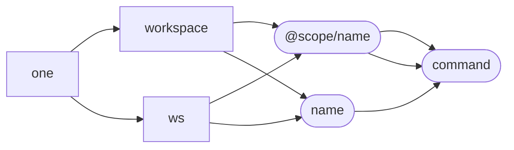

# oneRepo

## Problem

Current monorepo tooling either does too much or not enough in order to maintain a healthy monorepo for distributed organizations that need conformance, stability, and discoverability.

Many tools available rely on writing individual scripts into each workspace in a monorepo’s `package.json` file. This creates both a brittle setup as well as boilerplate and reduced reusability.

Furthermore, it is difficult to remember how to run scripts in individual workspaces due to lack of documentation on `package.json` scripts – and other tooling does not provide a way to enforce standards or help developers find what they’re looking for – relying instead on manual documentation, or worse, memory.

## Solution

**oneRepo** is a set of tools for creating monorepos that allows you to start with helpful defaults and opt-in to strict conformance, while allowing escape-hatches when you need something different.

oneRepo comes out of the box with three major pieces, each built upon the previous:

1. A commandline interface
1. A workspace graph
1. A task-runner

## Provided tools

### Commandline interface

```js
#!/usr/bin/env node

const { default: setup } = require('@onegraph/cli');

(async () => {
	const { run } = await setup(
		/** @type import('@onerepo/cli').Config */
		{}
	);
})();
```

### Workspace graph traversal

- Prevent cyclical dependencies
- Determine how changes affect workspaces
- Run tasks on subsets of workspaces
  - Based files changed, manual input, etc

### Workspace validation

- Ensure no conflicting shared dependency versions
- Ensure `package.json` conformance

### Commandline interface

- Prevent use of npm scripts (see [workspace validation](#workspace-validation))
- Ensures documentation
- Ensures discoverability
- Ensures using the same build/test pipeline (needs opt-out)

#### Features

- `one affected`: List the affected workspaces given the arguments
  - `-ws`: `Array<string>` workspace names
  - `--since-sha`: `string`
  - `--through-sha`: `string`
- `one publish`: Publish modules using the `affected` graph
- `one task`: Run lifecycle tasks (See [Tasks](#tasks))

- Workspace-specific commands
  - `one workspace @scope/name <command>`
  - `one workspace name <command>`
  - `one ws @scope/name <command>`
  - `one ws name <command>`



##### Tasks

```js title=<workspace>/one.config.js
module.exports = {
	'pre-commit': ['one lint', 'one test', 'one tsc'],
	'post-checkout': ['yarn install'],
};
```

```ts
type OneTask =
	| string
	| {
			command: string;
			match: string;
	  };

type OneTaskConfig = Record<Lifecycle, Array<OneTask | Array<OneTask>>>;
```

- `--lifecycle`
  - `pre-commit`
  - `post-checkout`
  - `pre-pull-request`
  - `pull-request`
  - `post-merge`
  - `pre-publish`
  - `install`
- `--list`: `boolean`
- `--format`: `'json' | 'pretty' | 'plain'`

Example usage:

```sh
one tasks -l pre-commit
```

## Alternatives

- Nx - Likely the most useful alternative of the bunch, but is effectively a workspace graph with npm script output caching. Some extra helpers, but limited in ability to enforce conformance cross-team collaboration.
- Turbo - Effectively just a (hidden) workspace graph with npm script output caching
- Lerna - Just a workspace graph
- Bazel - Too complicated
- Pants - Don't get me started

```ts
import eslint from '@onerepo/plugin-eslint';
import prettier from '@onerepo/plugin-prettier';
import tsc from '@onerepo/plugin-typescript';

interface OneValidator {
	name: string;
	fileGlob: string;
	required: boolean;
	validator: (contents: string) => boolean;
}

interface OnePlugin {
	commands: Array<{ path: string; name: string }>;
	validators?: Array<OneValidator>;
}

one({
	plugins: [eslint('lint'), prettier('format'), typescript('tsc')],
});
```

## GitHub Actions

TODO: Test and ensure this works, but it should…

Two-job setup to run lifecycle tasks in parallel

```yaml
jobs:
  setup:
    runs-on: ubuntu-latest
    outputs:
      tasks: ${{ steps.tasks.outputs.tasks }}
    steps:
      - name: Get tasks
        id: tasks
        run: |
          TASKS='$ ./one tasks --lifecycle=pull-request --list --format=json'
          echo ::set-output name=tasks::${TASKS}
  run_tasks:
    runs-on: ubuntu-latest
    needs: setup
    strategy:
      matrix:
        task: ${{ fromJSON(needs.tasks.outputs.tasks) }}
    steps:
      - name: Matrix => (${{ matrix.task }})
        run: |
          ${{ task }}
```
