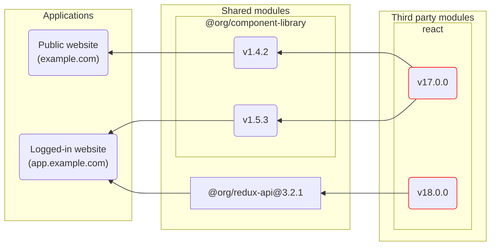
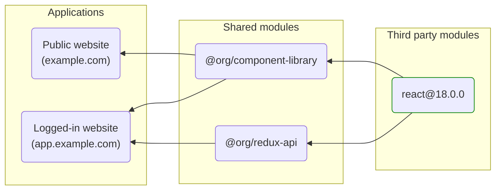

import { Tabs, TabItem } from '@astrojs/starlight/components';
import FileTree from '../../../components/FileTree.astro';

Modern software dependency graphs are complex and brittle. The following graph shows a theoretical problem that we may currently face between our own internal and external dependencies.

Given two applications: one for our logged-out, public facing marketing pages (`example.com`), and another for the logged in users (`app.example.com`). We have one shared dependency under our control for our component library (`@org/component-library`) and another for interfacing with our backend APIs (`@org/redux-api`):



In this situation, we have two web applications, `pub` and `auth` that are maintained with several shared internal repositories. However, since ensuring that dependencies are up to date is a manual process, developers only update dependencies when they know that the update is needed (eg, for new features). This results in a dependency graph could have multiple versions of the same dependency.

Notice that the _Logged-in website_ `app.example.com` now relies on two separate versions of React. Typically this shouldn't be a problem, as package managers and the Node.js require resolution algorithm will handle loading the correct version per shared module. However, many packages, React included, explicitly _do not work_ if there are multiple versions loaded within the same application.

While we can and should take steps to ensure that we don’t have conflicting major versions of dependencies, it is entirely possible that we could ship code with differing versions that have major differences in the way that they work. For example, if we were to ship an application like above with two versions of React and it slipped through, the worst case scenario is that one of these apps deploys in this state and ends up with a completely broken page response – resulting in potential loss of new or returning customers.

In an ideal scenario, we would have tools that automate enforcement of the same dependency version for all packages across all applications and packages. This would ensure maximum compatibility, fewer bugs, and smaller byte transfers to web visitors.



## node_modules

When package managers are configured as monorepos, they follow an array of glob patterns to determine where to find other source-level `package.json` files for determining install dependencies for the repository.

<Tabs>
  <TabItem label="npm">

    npm is configured using the [workspaces](https://docs.npmjs.com/cli/v10/using-npm/workspaces) field in the root `package.json`:

    ```json title="package.json"
    {
      "name": "root",
      "private": true,
      "workspaces": ["apps/*", "modules/*"]
    }
    ```

  </TabItem>
  <TabItem label="Yarn">

    Yarn, like npm, uses the [`workspaces`](https://yarnpkg.com/features/workspaces) field in the root `package.json`, but also enables additional features, like the `workspace:` protocol, focused installs, and parallel execution. It is recommended to set Yarn to use install modules using the [node-modules linker](https://yarnpkg.com/configuration/yarnrc#nodeLinker) to avoid compatibility issues
    .

    <div class="grid grid-cols-2">
    ```json title="package.json"
    {
      "name": "root",
      "private": true,
      "workspaces": ["apps/*", "modules/*"]
    }
    ```

    ```yaml title=".yarnrc.yaml"
    nodeLinker: node-modules
    ```
    </div>

  </TabItem>
  <TabItem label="pnpm">

    Unlike npm and Yarn, pnpm uses a special [`pnpm-workspace.yaml` file](https://pnpm.io/pnpm-workspace_yaml).

    <div class="grid grid-cols-2">
    ```json title="package.json"
    {
      "name": "root",
      "private": true,
      "workspaces": ["apps/*", "modules/*"]
    }
    ```
    ```yaml title="pnpm-workspaces.yaml"
    packages:
      - apps/*
      - modules/*
    ```
    </div>

  </TabItem>
</Tabs>

Using the `workspaces` globs configured previously for the package manager each matching location with a `package.json` will have its dependencies included to install. Taking a look at our three workspaces:

<div class="grid grid-cols-3">

```json title="./apps/menu/package.json"
{
	"name": "menu",
	"dependencies": {
		"tacos": "workspace:^",
		"tortillas": "workspace:^"
	}
}
```

```json title="./modules/burritos/package.json"
{
	"name": "burritos",
	"dependencies": {
		"lettuce": "^4.4.3",
		"tortillas": "^2.0.0"
	}
}
```

```json title="./modules/tacos/package.json"
{
	"name": "tacos",
	"dependencies": {
		"lettuce": "^4.0.0",
		"tortillas": "^1.8.0"
	}
}
```

</div>

Notice that each of the workspaces have dependencies on `lettuce` and `tortillas`, but there is a bit of a version mismatching. While both `lettuce` dependencies allow for major version `4.4.3` and above, `tortillas` on the other hand require separate major versions (`v2` for `burritos` and `v1` for `tacos`). In order to satisfy this, the package manager should deduplicate `lettuce` and resolve to only picking `4.4.3`, but will need to install `tortillas` versions separately so there are no conflicts. This will result in a file tree that may look something like this:

<FileTree>

- apps/
  - menu/
    - package.json
- modules/
  - tacos/
    - package.json
  - burritos/
    - node_modules/
      - tortillas/ @2.1.0
    - package.json
- node_modules/
  - burritos → ../modules/burritos
  - tacos → ../modules/tacos
  - lettuce/ @4.5.0
  - tortillas/ @1.9.4
- package.json

</FileTree>

:::note

Notice that not _all_ workspaces will have a `node_modules/` folder within them. When possible, your package manager will _hoist_ duplicate packages up to the root of the repository.

:::
